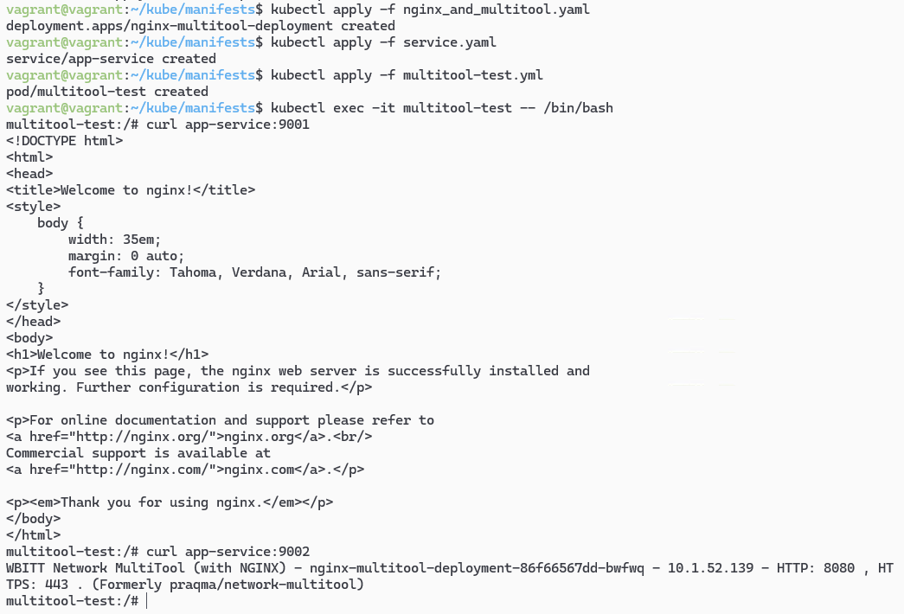
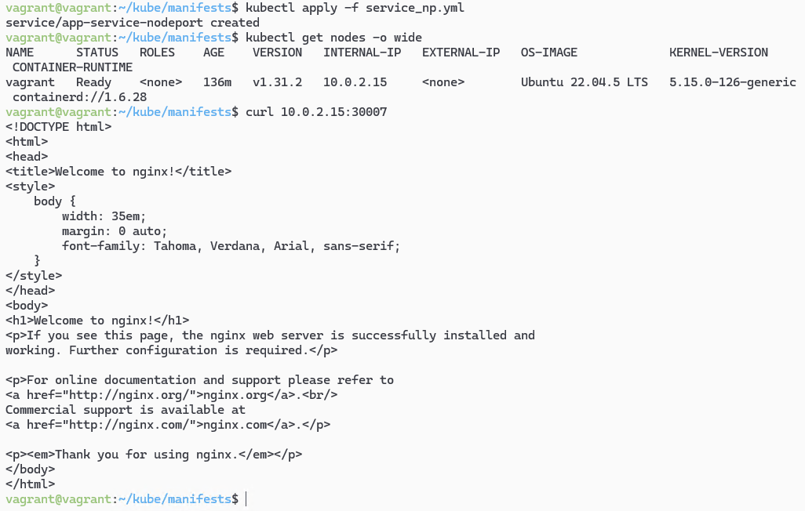
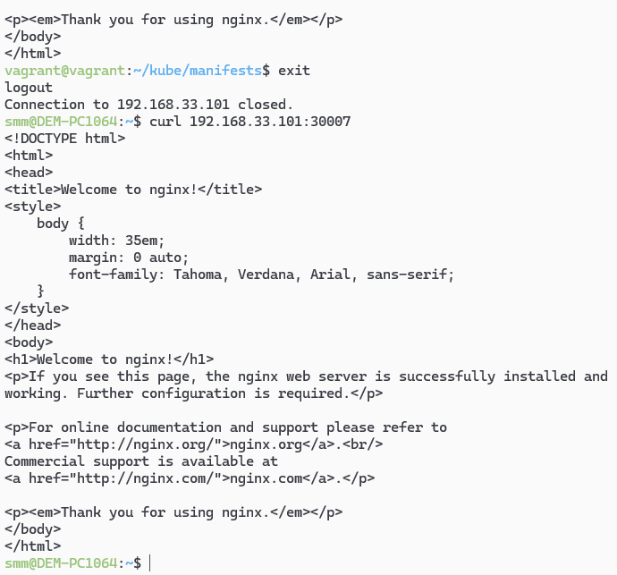
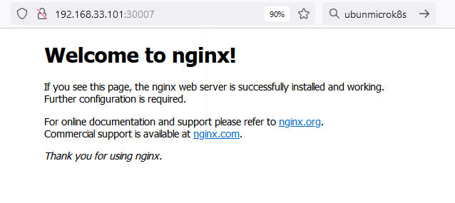

# Домашнее задание к занятию «Сетевое взаимодействие в K8S. Часть 1»- Михалёв Сергей

### Цель задания

В тестовой среде Kubernetes необходимо обеспечить доступ к приложению, установленному в предыдущем ДЗ и состоящему из двух контейнеров, по разным портам в разные контейнеры как внутри кластера, так и снаружи.


------

### Задание 1. Создать Deployment и обеспечить доступ к контейнерам приложения по разным портам из другого Pod внутри кластера

1. Создать Deployment приложения, состоящего из двух контейнеров (nginx и multitool), с количеством реплик 3 шт.
2. Создать Service, который обеспечит доступ внутри кластера до контейнеров приложения из п.1 по порту 9001 — nginx 80, по 9002 — multitool 8080.
3. Создать отдельный Pod с приложением multitool и убедиться с помощью `curl`, что из пода есть доступ до приложения из п.1 по разным портам в разные контейнеры.
4. Продемонстрировать доступ с помощью `curl` по доменному имени сервиса.
5. Предоставить манифесты Deployment и Service в решении, а также скриншоты или вывод команды п.4.

**Решение**

1. Использовал манифест, схожий с предыдущим ДЗ,  [nginx_and_multitool.yaml](manifests/nginx_and_multitool.yaml).
2. Написал  [service.yaml]( manifests/service.yaml). Ключевым моментом является описание портов:
```
ports:
    - protocol: TCP
      port: 9001
      targetPort: 80
      name: nginx-port
    - protocol: TCP
      port: 9002
      targetPort: 8080
      name: multitool-port
```
3. Написал pod для проверки подключения [multitool-test.yml](manifests/multitool-test.yml)
4. Запустил nginx_and_multitool.yaml, service.yaml и multitool-test.yml. Проверил доступ с помощью `curl` по доменному имени сервиса:
```
curl app-service:9001  # Проверка доступа к nginx
curl app-service:9002  # Проверка доступа к multitool
```
</br>

------

### Задание 2. Создать Service и обеспечить доступ к приложениям снаружи кластера

1. Создать отдельный Service приложения из Задания 1 с возможностью доступа снаружи кластера к nginx, используя тип NodePort.
2. Продемонстрировать доступ с помощью браузера или `curl` с локального компьютера.
3. Предоставить манифест и Service в решении, а также скриншоты или вывод команды п.2.

**Решение**
1. Написал манифест сервиса типа NodePort [service_np.yml](manifests/service_np.yml), где `nodePort: 30007`
2. Нашёл IP нода: `kubectl get nodes -o wide`
3. Проверил доступ с помощью браузера или `curl` с локального компьютера.
</br>
4. После проверки вышел из виртуальной машины и проверил доступность сервиса по порту:</br>
</br>
5. Проверил доступность nginx через браузер:</br>
</br>

------
